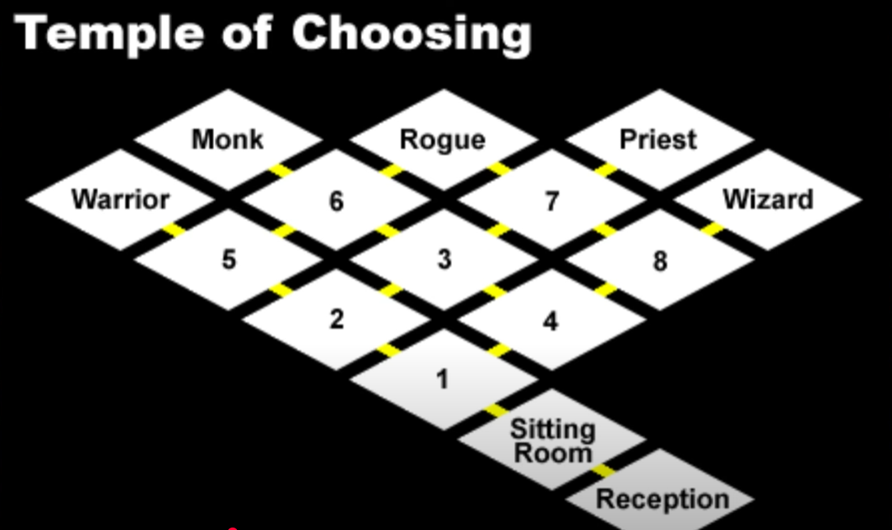
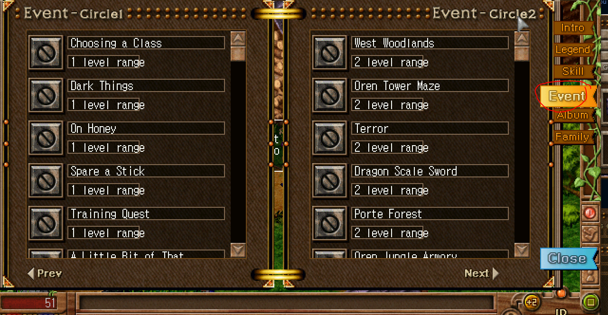
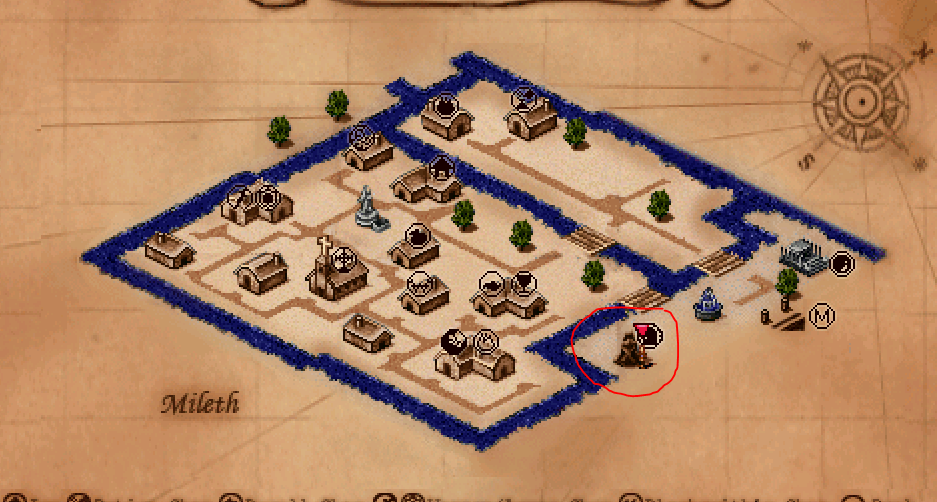
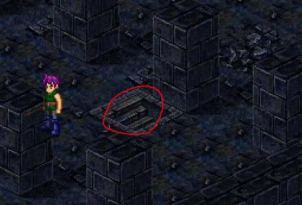
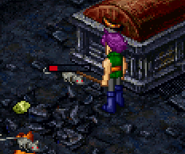
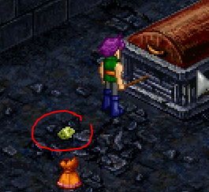
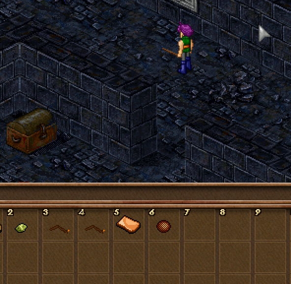
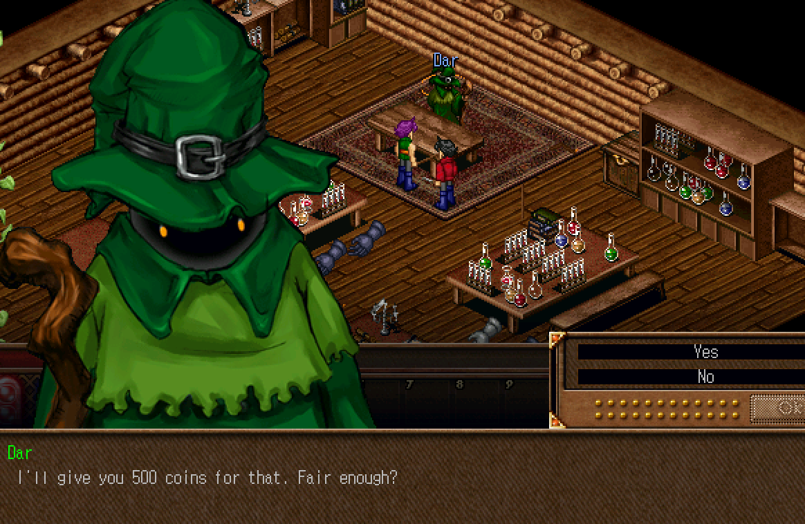

# Dark Ages Priest Beginner Guide

This guide will get you started as a Priest in Dark Ages!

## Class Change

If you have not already, get the class change found at the class change temple.

See below:

</img>

Map path to Temple of Choosing location. You can click the MAP icon in the bottom right of the game screen to open this menu.

</img>

Click on the pink dress NPC and select "Path Reception" and press Yes for all diagloue.

</img>

Map of the Temple of Choosing to choose a specific class. In your case, head towards Priest.

Additionally, you do NOT have to stand in the magic circles which can sometimes bug and drain your HP/mana multiple times. You can avoid them and go straight to the door.

Once selected, you will be teleported back out to the Temple's entrance.

## Basic Overview

When you level up, you get +2 stat points per level which can be put into different stats.

Looking into the spells menu, you can find the requirements for your first spells.

When you click on your character, a widget will open, then you can go to the spells menu and have a look.

</img>

On the right, click "Skill".

</img>

The colored icons are ones that you can learn from trainers, and the gray are locked still. In the top you can see the level and stat requirements to unlock the spells.

Additionally, in the EVENT tab, you can find repeatable quests.

</img>

They provide the location and coordinates to access the spells. For now, start below to get a concrete walkthrough of the start of the game.

## Start of your journey

The first goal of any character is to level up a few times to level 6. This'll let you unlock a few spells.

This means you will be entering the dungeon. You can do this solo or you can team up with other individuals to level even faster.

You can additionally choose to get a spell right now, but for now we'll focus on leveling up.

Head to the dungeon marked on the map below:

</img>

</img>

To begin the dungeon, walk down these stairs.

You can attack mice by spamming right click, then left click and drag loot to your free inventory slots.

</img>

Attacking mice.

</img>

Mice drop loot.

</img>

Loot in inventory after dragging it to the slot.

</img>

You can also pick up after others to get free additional cash.

</img>

You can check your current level, experience and required experience to level in the info tab at the bottom of your screen.

Grind this dungeon until your level 6. Also see below for selling dungeon loot.

## Selling Loot

Each vender buys different items. Some buy at better rates than others, so you'll have to investigate each shop to see whether they are buying your materials at the best price (if you want to get the max reward).

</img>

For example, the black witch den shop at the top bought my spider eyes.

</img>

Getting 500 coins for one spider eye, seems great!

</img>

Cian next door in the potion shop bought my moldy bread and mold.

You can walk around to each shop when you get different types of loot to see where you can sell it for the most!

# Additional Links

- https://vorlof.com/
- https://www.da-wizard.com/
- https://wanderlustdb.com/
- https://nagisachanda.gitlab.io/guide-for-new-priests/
- https://www.youtube.com/watch?v=FIFty-O4rOE
- https://nagisachanda.gitlab.io/damage-received/main.htm
