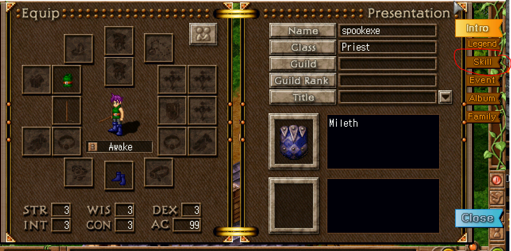
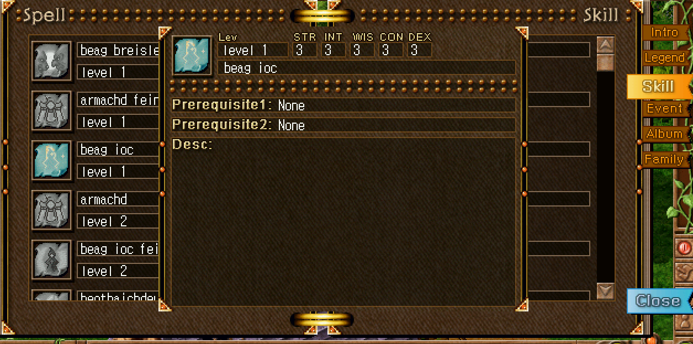
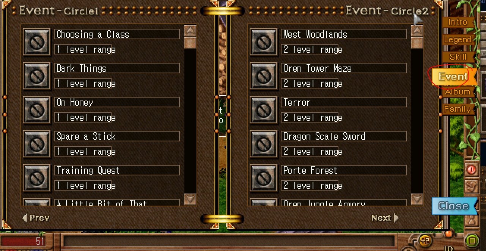

## Basic Overview

When you level up, you get +2 stat points per level which can be put into different stats.

Looking into the spells menu, you can find the requirements for your first spells.

When you click on your character, a widget will open, then you can go to the spells menu and have a look.

</img>

On the right, click "Skill".

</img>

The colored icons are ones that you can learn from trainers, and the gray are locked still. In the top you can see the level and stat requirements to unlock the spells.

Additionally, in the EVENT tab, you can find repeatable quests.

</img>

They provide the location and coordinates to access the spells. For now, start below to get a concrete walkthrough of the start of the game.

## [RETURN TO README](../README.md)
