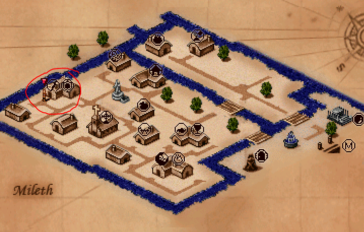
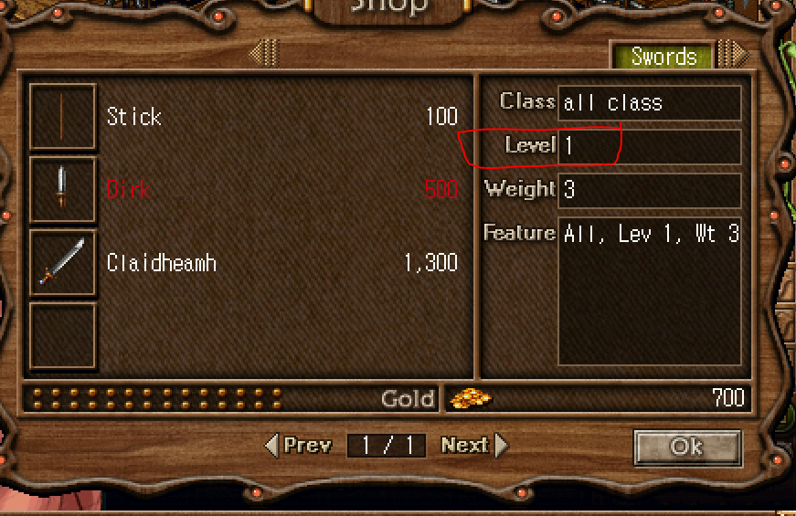
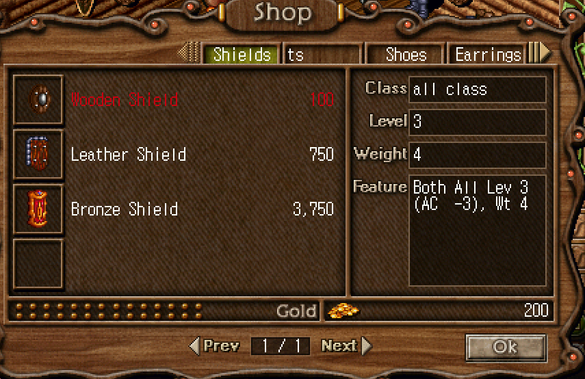

## Buying New Equipment

When you are a low-level character, getting equipment is straight forward.

Head to the weapon shop and buy it there using the coins you gathered by selling materials to the vendors.

See the map below for the location:

</img>

Also note the **level requirement** on weapons.

</img>

</img>

As you level up, you'll be able to buy better equipment here.
