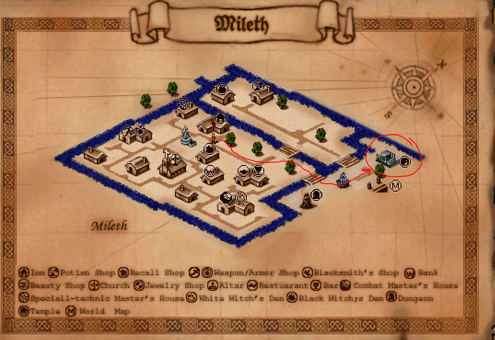
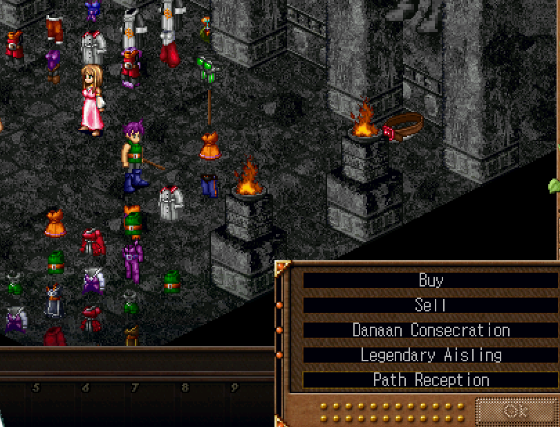

## Class Change

If you have not already, get the class change found at the class change temple.

See below:

</img>

Map path to Temple of Choosing location. You can click the MAP icon in the bottom right of the game screen to open this menu.

</img>

Click on the pink dress NPC and select "Path Reception" and press Yes for all diagloue.

</img>

Map of the Temple of Choosing to choose a specific class. In your case, head towards Priest.

Additionally, you do NOT have to stand in the magic circles which can sometimes bug and drain your HP/mana multiple times. You can avoid them and go straight to the door.

Once selected, you will be teleported back out to the Temple's entrance.

## [RETURN TO README](../README.md)
