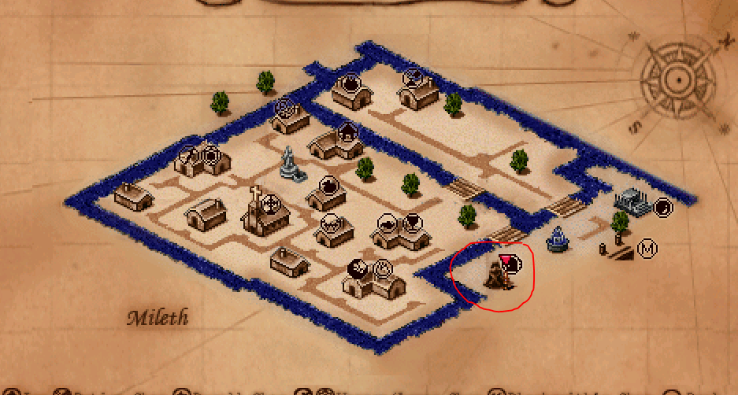
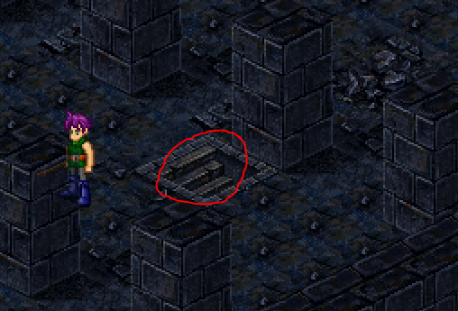
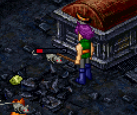
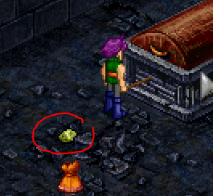
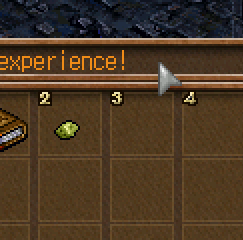
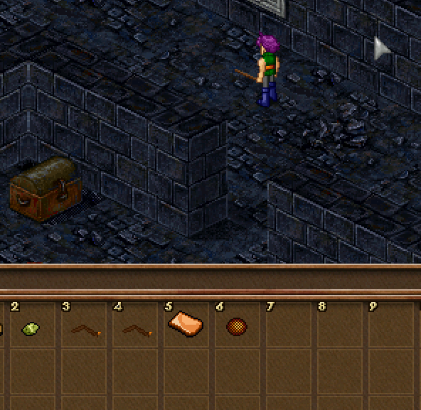
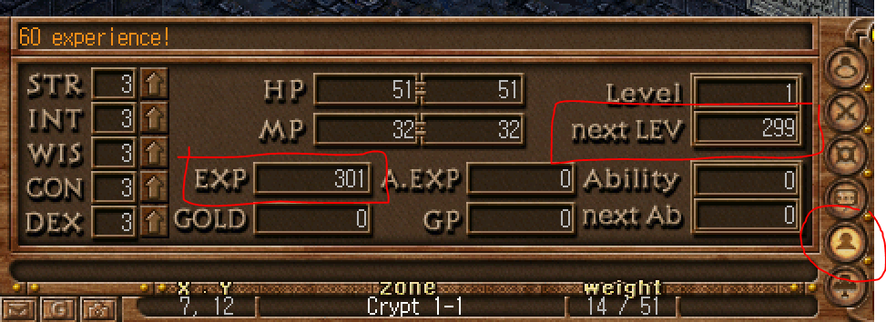

## Start of your journey

The first goal of any character is to level up a few times to level 6. This'll let you unlock a few spells.

This means you will be entering the dungeon. You can do this solo or you can team up with other individuals to level even faster.

You can additionally choose to get a spell right now, but for now we'll focus on leveling up.

Head to the dungeon marked on the map below:

</img>

</img>

To begin the dungeon, walk down these stairs.

You can attack mice by spamming right click, then left click and drag loot to your free inventory slots.

</img>

Attacking mice.

</img>

Mice drop loot.

</img>

Loot in inventory after dragging it to the slot.

</img>

You can also pick up after others to get free additional cash.

</img>

You can check your current level, experience and required experience to level in the info tab at the bottom of your screen.

Grind this dungeon until your level 6.

See the next section for selling dungeon loot.

## [RETURN TO README](../README.md)
